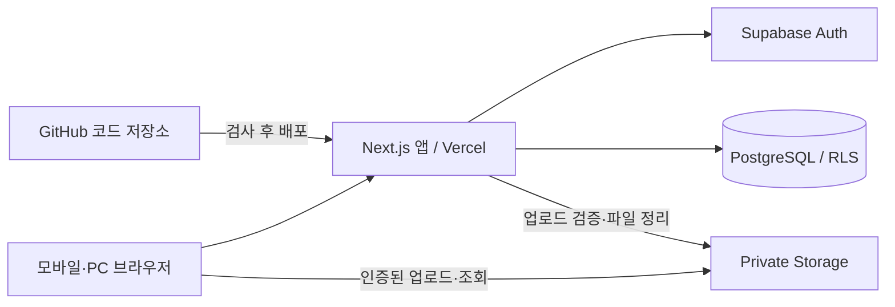
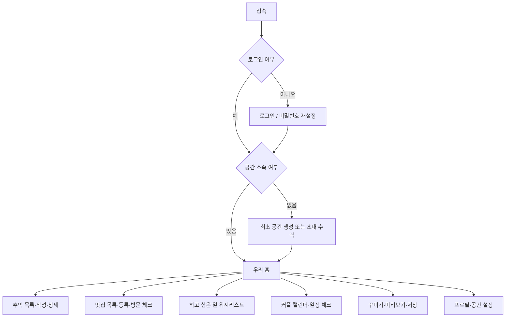
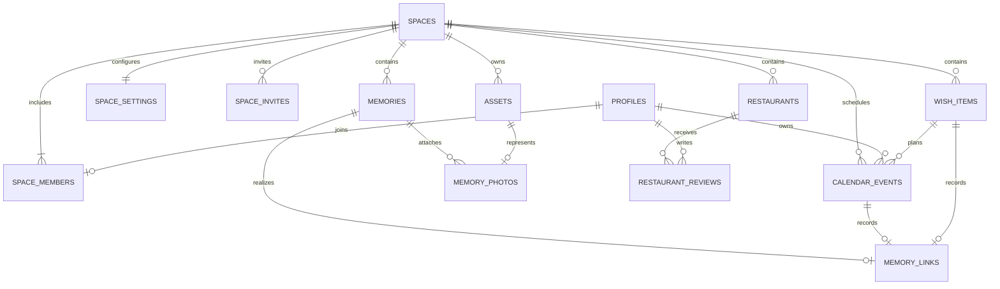

# 여자친구와 함께 만드는 홈페이지 — 상세 설계서

작성일: 2026-09-19 · 버전: 0.1 · 상태: 구현 전 설계안

- 기획 기준: [PROJECT_PLAN.md](./PROJECT_PLAN.md)
- 기술 기준: [TECH_STACK.md](./TECH_STACK.md)
- 코드 저장소: [KimSeungCheol4589/girlfriend](https://github.com/KimSeungCheol4589/girlfriend)

이 문서는 첫 버전의 화면, 데이터, 권한, 서버 작업과 실패 처리 기준을 정의한다. 아래 제한값과 디자인은 제안 기본값이다. 실제 앱·DB·배포 환경은 아직 구현하지 않았다.

## 1. 설계 범위와 기본 결정

| 항목 | 설계 결정 |
| --- | --- |
| 사용자 | 이메일로 로그인하는 두 사람, 계정당 공유 공간 하나 |
| 접근 | 앱 데이터와 사진은 비공개. GitHub 코드 저장소의 공개 여부와 별개 |
| 공동 작업 | 두 사람 모두 추억·맛집·홈 설정 편집 가능, 개인 후기만 본인 편집 |
| 위시 | 맛집 외 장소·활동·여행·쇼핑·기타를 공유 저장, 두 사람 모두 계획·완료 처리 가능 |
| 일정 | 개인 일정은 둘 다 조회·본인만 수정, 공동 데이트 일정은 둘 다 수정·완료 가능 |
| 데이트 기록 | 기존 추억에 위시·일정을 선택적으로 연결하고 사진·본문·장소를 실제 기록으로 보존 |
| 저장 방식 | 서버 저장 후 화면 갱신, 실시간 공동 편집은 제외 |
| 꾸미기 | 테마 3종, 포인트 색상, 커버, 섹션 순서·표시 여부, 추억 고정 |
| 지도 | 외부 지도 링크 저장·열기, API 검색·자동 수집 제외 |
| 추억 사진 | 기록당 0~10장, 입력 파일당 10MiB 이하, 압축본 보관 |
| 날짜 | 표시 기준 Asia/Seoul, 관계 시작 당일은 1일 |
| 초기 운영 | 운영자가 첫 계정을 준비하고 상대방 이메일로 초대, 무제한 공개 가입 제외 |

관계 시작일 계산 방식은 출시 전에 두 사람이 변경할 수 있는 기획 결정이다. 공간 탈퇴·구성원 교체·공간 전체 삭제는 MVP 화면에서 제공하지 않고, 필요 시 백업 후 별도 관리 절차를 설계한다.

## 2. 시스템 구조와 책임



- 화면: React 컴포넌트, Tailwind CSS와 CSS 변수로 구성한다.
- 조회: 서버에서 세션과 공간 소속을 확인하고 사용자 권한으로 조회한다.
- 변경: Server Action에서 입력 검증 후 DB 함수로 상태를 변경한다.
- DB: 소속, 제약, 수정 버전, 여러 행의 원자적 저장을 보장한다.
- Storage: 파일 본문을 보관한다. DB에는 파일 경로·크기·소유 관계만 저장한다.
- GitHub: 코드·문서·migration·테스트를 관리한다. 사진·DB 덤프·실제 사용자 정보는 올리지 않는다.

서버 작업 이름은 이 문서의 계약 이름이며 공개 REST API 경로가 아니다. 인증 콜백과 파일 전달 등 HTTP 경로가 필요한 작업만 Route Handler로 분리한다.

## 3. 사용자 흐름과 페이지



| URL | 화면·주요 행동 | 예외 상태 |
| --- | --- | --- |
| `/login` | 로그인, 재설정 이메일 요청 | 인증 실패, 이메일 발송 실패 |
| `/auth/callback`, `/reset-password` | 인증 완료, 새 비밀번호 설정 | 만료된 링크 |
| `/onboarding` | 승인된 최초 사용자 공간 생성 | 이미 소속됨, 생성 권한 없음 |
| `/invite` | 로그인 후 일회용 초대 수락 | 만료·사용 완료·대상 이메일 불일치·정원 초과 |
| `/` | 커버, 소개, 함께한 날짜, 추억·맛집 요약 | 빈 공간, 조회 실패 |
| `/memories` | 월·태그 필터, 20개씩 더 보기 | 결과 없음 |
| `/memories/new` | 글과 사진 작성 | 입력 오류, 업로드 실패 |
| `/memories/[id]` | 갤러리, 글, 수정·삭제·고정 | 없거나 접근 불가하면 동일한 404 |
| `/memories/[id]/edit` | 기록 수정 | 버전 충돌 |
| `/restaurants` | 상태·지역·종류 필터, 이름 검색 | 결과 없음 |
| `/restaurants/new` | 맛집 등록 | 입력 오류 |
| `/restaurants/[id]` | 수정, 방문 체크, 각자의 후기 | 삭제된 항목, 버전 충돌 |
| `/wishes` | 분류·상태 필터, 위시 등록·수정·완료, 일정 만들기 | 결과 없음, 버전 충돌 |
| `/calendar` | 월·목록 보기, 개인·공동 일정 등록·수정·완료 | 겹친 일정, 권한 없음, 버전 충돌 |
| `/calendar/[id]` | 일정 상세, 완료 체크, 데이트 기록 만들기 | 삭제된 일정, 상대 개인 일정 수정 금지 |
| `/customize` | 테마·커버·섹션 미리보기 및 저장 | 저장 실패, 버전 충돌 |
| `/settings` | 닉네임, 공간 이름·소개·시작일, 구성원, 초대 | 정원 충족, 입력 오류 |

필터는 URL 검색 매개변수에 저장해 뒤로 가기에도 유지한다. 추억은 `memory_date DESC, id DESC`, 맛집은 `created_at DESC, id DESC`로 정렬하며 해당 쌍을 커서로 사용한다. 필터 변경 시 커서를 초기화한다.

## 4. 화면·디자인 구성

### 4.1 기본 배치

```text
모바일 홈                       PC 홈
┌─────────────────────┐        ┌──────────────────────────────────┐
│ 공간 이름        설정 │        │ 공간 이름  홈 추억 맛집 꾸미기 설정 │
│      커버 사진       │        │            커버 사진              │
│ 한 줄 소개 · 함께 N일 │        │       한 줄 소개 · 함께 N일        │
│ 고정한 추억          │        │ 고정한 추억                       │
│ 최근 추억 카드       │        │ 최근 추억 카드  카드  카드         │
│ 가고 싶은 맛집       │        │ 가고 싶은 맛집                    │
│ 홈  추억  맛집 꾸미기 │        └──────────────────────────────────┘
└─────────────────────┘
```

- 콘텐츠 최대 폭 1,120px, 모바일 좌우 여백 16px, PC 여백 24px 이상을 기본으로 한다.
- 모바일은 하단 메뉴, 768px 이상에서는 상단 메뉴를 사용한다.
- 테마 키는 `cream`, `rose`, `sage`. 기본 배경은 아이보리, 본문은 진한 회색이다.
- 색상 변수는 `background`, `surface`, `text`, `muted`, `accent`, `border`로 나눈다.
- 포인트 색상을 바꿔도 본문 대비는 유지한다. 밝은 포인트에는 어두운 글자를 사용한다.
- 주요 터치 영역은 44px 이상을 목표로 하고 키보드 포커스·폼 라벨을 제공한다.
- 사진 첫 장을 목록 대표 이미지로 사용한다. 사진 없는 추억에는 날짜와 제목 카드를 표시한다.
- 공통 컴포넌트: `AppShell`, `MemoryCard`, `RestaurantCard`, `PhotoUploader`, `EmptyState`, `ConfirmDialog`, `ErrorNotice`, `ThemePreview`.

### 4.2 꾸미기 저장 모델

```json
{
  "themeKey": "cream",
  "accentColor": "#8B435A",
  "coverAssetId": null,
  "sections": [
    { "key": "pinned", "visible": true },
    { "key": "recentMemories", "visible": true },
    { "key": "wishlist", "visible": true }
  ],
  "expectedVersion": 1
}
```

각 섹션 키는 정확히 한 번 포함하고 순서만 바꿀 수 있다. 위·아래 이동 버튼으로 순서를 변경한다. 미리보기는 브라우저 상태에만 적용하고 ‘저장’할 때 공유 설정을 변경한다. 취소하면 마지막 저장 상태로 돌아간다. 미저장 상태에서 이동 시 확인한다.

## 5. 데이터 설계

### 5.1 관계



DB 테이블명은 소문자 snake_case다. `id`는 UUID, 시각은 `timestamptz`, 달력 날짜는 `date`를 사용한다. 수정 가능한 엔티티에는 `created_at`, `updated_at`, `version integer NOT NULL DEFAULT 1`을 둔다. 버전은 서버가 증가시킨다.

### 5.2 테이블 명세

| 테이블 | 주요 열·자료형 | 제약·규칙 |
| --- | --- | --- |
| `profiles` | `id uuid`, `nickname text` | PK는 Auth 사용자 ID 참조, 닉네임 1~20자 |
| `spaces` | `id`, `created_by uuid`, `name text`, `introduction text`, `relationship_start_date date nullable`, `version` | 이름 1~30자, 소개 200자 이하 |
| `space_members` | `space_id uuid`, `user_id uuid`, `joined_at` | 복합 PK, `UNIQUE(user_id)`로 계정당 공간 하나 |
| `space_invites` | `id`, `space_id`, `token_hash text`, `target_email text`, `expires_at`, `accepted_at nullable`, `accepted_by uuid nullable`, `revoked_at nullable` | 토큰 해시 UNIQUE, 원문 저장 금지 |
| `space_settings` | `space_id`, `theme_key text`, `accent_color text`, `cover_asset_id uuid nullable`, `home_sections jsonb`, `version` | space_id PK, 허용 테마·색상·JSON 구조 검증 |
| `memories` | `id`, `space_id`, `author_id uuid`, `title text`, `body text`, `memory_date date`, `location text nullable`, `tags text[]`, `is_pinned boolean`, `version` | 제목 1~80자, 본문 10,000자 이하, 태그 최대 5개·각 20자 |
| `assets` | `id`, `space_id`, `uploader_id uuid`, `purpose text`, `object_path text`, `state text`, `mime_type text`, `bytes bigint`, `width int`, `height int`, `expires_at`, `created_at` | 경로 UNIQUE, 목적 memory/cover, 상태 pending/ready/deleting |
| `memory_photos` | `id`, `memory_id`, `asset_id uuid`, `sort_order int` | asset_id UNIQUE, `(memory_id, sort_order)` UNIQUE, 순서 0~9 |
| `restaurants` | `id`, `space_id`, `created_by uuid`, `name text`, `area text`, `category text`, `map_url text nullable`, `memo text`, `status text`, `visited_date date nullable`, `version` | 상태 wishlist/visited, 이름 1~100자, 메모 2,000자 이하 |
| `restaurant_reviews` | `id`, `restaurant_id`, `user_id uuid`, `rating smallint`, `comment text`, `version` | `(restaurant_id,user_id)` UNIQUE, 별점 정수 1~5, 후기 500자 이하 |
| `wish_items` | `id`, `space_id`, `created_by uuid`, `title text`, `category text`, `memo text`, `link_url text nullable`, `status text`, `planned_date date nullable`, `version` | 분류 place/activity/trip/shopping/other, 상태 wish/planned/done, 제목 1~100자 |
| `calendar_events` | `id`, `space_id`, `created_by uuid`, `owner_id uuid nullable`, `kind text`, `title text`, `note text`, `starts_at timestamptz`, `ends_at timestamptz nullable`, `all_day boolean`, `status text`, `wish_item_id uuid nullable`, `version` | kind personal/date, owner null이면 공동 일정, 상태 scheduled/done/cancelled, 종료는 시작 이후 |
| `memory_links` | `memory_id uuid`, `calendar_event_id uuid nullable`, `wish_item_id uuid nullable` | memory_id PK, 같은 공간의 일정·위시만 연결, 둘 중 하나 이상 필요 |
| `mutation_requests` | `user_id`, `request_id uuid`, `operation text`, `payload_hash text`, `result jsonb`, `created_at` | `(user_id,request_id)` PK, 중복 생성·최종 저장 재시도 결과 보관 |

`assets`와 `mutation_requests`는 기술 스택 초안에서 추가한 구현용 테이블이다. 프로필 사진은 MVP에서 이니셜로 대신한다. 커버는 `cover_asset_id`를 참조하며 `cover_path`와 중복 저장하지 않는다.

### 5.3 데이터 무결성

- 구성원 수 제한은 단순 행 CHECK로 구현하지 않는다. 공간 행을 잠근 트랜잭션에서 인원 확인 후 추가한다.
- 공간 생성은 spaces·space_members·space_settings를 한 트랜잭션으로 생성한다.
- 자식 FK를 설정하고 사진·커버 연결은 같은 공간의 ready 파일만 허용한다. 이 조건은 DB 함수에서도 검사한다.
- 사진 개수 확인·순서 변경은 추억 행을 잠그고 한 번에 처리한다. 순서 UNIQUE는 트랜잭션 종료 시 검사하도록 설계한다.
- 작성자·공간 ID는 생성 후 변경 불가다. 사용자가 보낸 작성자 ID를 신뢰하지 않는다.
- 맛집 상태가 visited면 방문일 필수, wishlist면 방문일은 NULL이다. 방문일은 한국 기준 오늘 이후를 허용하지 않는다.
- visited에서 wishlist로 되돌릴 때 기존 후기가 있으면 삭제 여부를 확인하고, 확인된 요청만 후기 삭제와 상태 변경을 한 트랜잭션으로 처리한다.
- 후기 등록·수정도 맛집 행을 잠그고 visited 상태를 확인한다. 상태 되돌리기와 동시에 실행돼도 후기가 남지 않게 한다.
- 위시는 `wish → planned → done`을 기본 흐름으로 사용하며, 완료 후에도 기록을 삭제하지 않는다. 일정 연결·완료와 경쟁하면 행 잠금과 version으로 충돌을 알린다.
- 개인 일정은 `owner_id`가 구성원 ID이고 소유자만 변경한다. 공동 데이트 일정은 `owner_id = null`이며 두 구성원 모두 변경할 수 있다.
- 일정 완료 체크는 삭제와 구분한다. 완료 일정은 데이트 기록 작성 대상으로 남고, 연결된 추억을 삭제해도 일정 자체는 유지한다.
- `memory_links`는 같은 공간 관계만 허용하며 위시·일정과 추억의 날짜가 달라도 강제로 수정하지 않고 사용자에게 확인만 표시한다.
- 본문은 일반 텍스트로 렌더링하며 임의 HTML을 해석하지 않는다.
- 인덱스: 추억 `(space_id,memory_date DESC,id DESC)`, 맛집 `(space_id,status,created_at DESC,id DESC)`, 파일 `(state,expires_at)`, 초대 `token_hash`.

## 6. 권한 설계

| 데이터·행동 | 비로그인·공간 외부 | 공간 구성원 | 추가 조건 |
| --- | --- | --- | --- |
| 공간·추억·맛집 조회 | 거부 | 허용 | 요청 공간 소속 확인 |
| 추억·맛집·공간 설정 변경 | 거부 | 허용 | 버전 일치, 허용 필드만 변경 |
| 프로필 조회 | 거부 | 본인·상대방만 | 수정은 본인만 |
| 개인 후기 조회 | 거부 | 허용 | 생성·수정·삭제는 본인만 |
| 맛집 삭제·방문 취소 | 거부 | 허용 | 연결된 후기 제거를 명시적으로 확인 |
| 위시 조회·변경 | 거부 | 허용 | 같은 공간, version 일치 |
| 개인 일정 조회 | 거부 | 허용 | 같은 공간의 두 구성원 모두 조회 |
| 개인 일정 변경 | 거부 | 소유자만 | owner_id가 현재 사용자, version 일치 |
| 공동 데이트 일정 변경 | 거부 | 허용 | owner_id null, version 일치 |
| 구성원 직접 추가·수정 | 거부 | 거부 | 검증된 생성·초대 DB 함수로만 처리 |
| 사진 다운로드 | 거부 | 허용 | ready 상태이며 연결된 활성 기록·커버 확인 |
| 대기 중 파일 | 거부 | 업로더만 | 다른 구성원에게 미저장 사진 노출 금지 |
| 초대 원문·해시 조회 | 거부 | 직접 조회 거부 | 생성 시 링크 한 번 반환, 상태만 조회 |

공개 스키마의 모든 테이블에 RLS와 최소 권한 GRANT를 함께 적용한다. 일반 조회는 사용자 세션을 사용하고, 변경은 테이블 직접 쓰기 권한을 제거한 전용 DB 함수로 수행한다. 함수는 사용자 ID·공간 소속·허용 상태를 매번 검사한다.

권한 상승이 필요한 함수는 고정 `search_path`, 스키마를 포함한 테이블명, 제한된 EXECUTE 권한을 사용한다. 소속 확인 함수는 RLS 정책의 자기 참조로 무한 재귀하지 않도록 별도 제한 함수로 설계하고 직접 호출 테스트를 수행한다.

RLS와 SQL 권한은 서로 다른 검사이므로 둘 다 정의해야 한다. 관련 구현 기준은 [Supabase RLS 문서](https://supabase.com/docs/guides/database/postgres/row-level-security)를 따른다.

## 7. 서버 작업 계약

공통 입력에서 사용자와 공간 소속은 서버가 세션으로 확인한다. `expectedVersion`은 수정 직전에 읽은 버전, `requestId`는 같은 요청을 재시도할 때 유지하는 UUID다.

| 작업 이름 | 주요 입력 | 성공 결과·부작용 |
| --- | --- | --- |
| `createSpace` | 이름, 소개, 시작일, requestId | 공간·본인 소속·기본 테마 생성 |
| `createInvite` | 대상 이메일 | 24시간 만료 링크 반환, 이전 활성 초대 폐기 |
| `acceptInvite` | 토큰 | 대상 이메일·정원 확인 후 소속 생성 |
| `prepareUpload` | 목적, 파일 유형·크기, requestId | pending asset·업로드 경로 발급 |
| `finalizeUpload` | assetId | 실제 파일 검증 후 ready 전환 |
| `saveMemory` | id(수정 시), 글·날짜·태그, 사진 ID 순서, expectedVersion, requestId | 추억과 사진 연결 원자적 저장 |
| `deleteMemory` | id, expectedVersion, requestId | 기록 삭제, 파일을 deleting 상태로 전환 |
| `saveRestaurant` | id(수정 시), 맛집 정보, expectedVersion, requestId | 생성·정보 수정 |
| `setRestaurantStatus` | id, 상태, 방문일, 후기 삭제 확인, expectedVersion, requestId | 방문 상태 변경 |
| `saveReview` / `deleteReview` | 맛집 ID, 후기·별점 또는 후기 ID, expectedVersion, requestId | 본인 후기 저장·삭제 |
| `deleteRestaurant` | id, expectedVersion, requestId | 맛집과 연결 후기 삭제 |
| `saveWish` / `deleteWish` | id(수정 시), 제목·분류·메모·링크, expectedVersion, requestId | 일반 위시 생성·수정·삭제 |
| `setWishStatus` | id, 상태·계획일, expectedVersion, requestId | 하고 싶음·계획됨·완료 전환 |
| `saveCalendarEvent` / `deleteCalendarEvent` | id(수정 시), 개인/공동·시간·메모·위시, expectedVersion, requestId | 일정 생성·수정·삭제와 소유권 확인 |
| `setCalendarEventStatus` | id, scheduled/done/cancelled, expectedVersion, requestId | 일정 완료 체크·취소 |
| `linkMemoryPlan` | memoryId, eventId?, wishId?, expectedVersion, requestId | 사진 추억을 완료 일정·위시와 연결 |
| `saveCustomization` | 테마·커버·섹션, expectedVersion, requestId | 공유 테마 저장, 이전 커버 정리 |
| `updateProfile` / `updateSpace` | 허용 설정 필드, expectedVersion, requestId | 본인 프로필 또는 공유 정보 변경 |

프로필에도 수정 버전을 둔다. 후기가 없을 때 생성 요청의 expectedVersion은 0, 기존 후기 수정 시 현재 버전을 보낸다. 생성 시 경쟁은 UNIQUE 제약으로 검출한다.

성공 응답은 `{ ok: true, data }`, 실패는 `{ ok: false, code, message, fieldErrors? }`다. 오류 코드는 `UNAUTHENTICATED`, `NOT_FOUND`, `VALIDATION_ERROR`, `CONFLICT`, `INVITE_INVALID`, `SPACE_FULL`, `UPLOAD_FAILED`, `RETRYABLE_ERROR`를 사용한다. 외부 사용자가 데이터 존재 여부를 추측할 수 없도록 조회 권한 오류는 NOT_FOUND로 통일한다.

## 8. 핵심 처리 흐름

### 8.1 초대 수락

1. 운영자가 최초 사용자 이메일을 서버 설정에 등록한다. 해당 사용자만 첫 공간을 만들 수 있다.
2. 구성원이 상대방 이메일로 초대를 생성한다. 충분한 난수 토큰의 해시와 만료만 DB에 저장한다.
3. 상대방은 이메일 소유 확인을 완료한 계정으로 로그인한다. 실제 가입·인증 링크 전달은 Auth 설정과 함께 구현한다.
4. 초대 수락 DB 함수가 공간·초대 행을 잠그고 대상 이메일, 만료, 사용 여부, 기존 소속, 현재 인원을 검사한다.
5. 구성원 추가와 초대 사용 처리를 같은 트랜잭션으로 완료한다. 정원 두 명이면 다른 초대는 사용할 수 없다.
6. 같은 사용자의 수락 재시도는 기존 성공을 반환하고, 다른 사용자의 재사용은 거부한다.

초대 토큰은 URL fragment로 받아 로그인 과정 동안 필요한 최소 시간만 보관하고, 수락 후 URL과 브라우저 임시 저장소에서 제거한다. 토큰·인증 링크를 로그에 남기지 않는다.

### 8.2 사진과 추억 저장

1. 브라우저가 입력 크기·유형을 확인하고 미리보기를 생성한다. HEIC는 MVP에서 안내와 함께 거부한다.
2. 이미지 방향을 반영해 긴 변 최대 2,048px의 WebP 또는 JPEG로 재인코딩하고 EXIF를 제거한다.
3. `prepareUpload`가 pending asset을 만들고 `spaceId/assetId.ext` 경로를 정한다. 다른 경로와 덮어쓰기는 허용하지 않는다.
4. 사용자 세션으로 파일을 Storage에 직접 업로드한다.
5. `finalizeUpload`는 서버에서 실제 크기·파일 디코딩·치수를 검사한다. 헤더의 MIME만 신뢰하지 않는다. 디코딩 픽셀 수는 최대 40MP로 제한한다.
6. `saveMemory`가 ready asset의 소속·소유자·미연결 여부를 검사하고 본문과 사진 순서를 한 트랜잭션으로 저장한다. 기존에 연결된 사진 유지·재정렬은 양쪽 구성원에게 허용한다.
7. 실패하면 작성 글과 성공한 업로드를 화면에 남겨 재시도한다. 자동으로 새 기록을 만들지 않는다.

첨부되지 않은 pending·ready 파일은 24시간 후 정리 대상으로 삼는다. 정리와 첨부는 asset 행 잠금으로 직렬화하고 deleting 상태의 파일은 첨부하지 못하게 한다. 커버도 같은 절차를 사용한다.

### 8.3 삭제와 파일 정리

DB와 Storage 삭제는 단일 트랜잭션이 아니므로 먼저 DB에서 참조 제거와 deleting 상태 전환을 커밋한다. 이후 Storage 삭제를 재시도 가능한 정리 작업으로 실행한다. 파일이 이미 없으면 성공으로 처리하고, 성공 후 asset 메타데이터를 제거한다. 초기에는 운영용 수동 명령을 제공하고 일일 정리 작업은 배포 환경에서 설정한다.

private bucket은 인증된 조회 또는 서명 URL로 제공한다. 기본안은 인증된 다운로드이며 필요 시 서명 URL을 5분으로 제한한다. 삭제 직후에도 이미 발급한 URL은 만료 전까지 유효할 수 있다. [Supabase 버킷 문서](https://supabase.com/docs/guides/storage/buckets/fundamentals)

### 8.4 동시 수정·중복 요청

수정은 `WHERE id = :id AND version = :expectedVersion` 조건과 버전 증가를 같은 트랜잭션에서 수행한다. 이미 버전이 바뀌었으면 CONFLICT를 반환하고 사용자가 작성한 내용을 유지한 채 최신 기록을 다시 보도록 안내한다.

`mutation_requests`는 사용자·requestId 단위로 결과를 보관한다. 같은 키·같은 입력은 이전 결과를 반환하고, 같은 키·다른 입력은 거부한다. 실제 변경과 결과 저장을 같은 DB 트랜잭션에 넣는다. 네트워크 응답 유실 후 재전송해도 한 번만 반영되게 한다.

## 9. 입력·상태·접근성 기준

- 지도 링크는 HTTPS URL만 허용하고 MVP에서는 네이버·카카오 지도용으로 확인한 호스트 목록을 설정으로 관리한다. 서버가 링크를 가져오지 않는다.
- 시작일 미설정 시 날짜 배지를 숨긴다. 미래 시작일은 거부하고 날짜 차이는 시간 밀리초가 아닌 한국 달력 날짜로 계산한다.
- 로딩 중에는 스켈레톤, 실패 시 재시도 버튼, 비어 있으면 첫 기록·맛집 추가 버튼을 제공한다.
- 저장 중 버튼을 비활성화하되 DB에서도 중복 요청을 방지한다.
- 삭제 확인에 대상 제목과 사진·후기 함께 삭제 여부를 표시한다.
- 폼 오류는 해당 필드와 상단 요약에 표시하고 첫 오류 필드로 포커스를 이동한다.
- 브라우저를 닫으면 미저장 글은 사라지는 것이 MVP 동작이다. 자동 임시 저장은 후속 기능이다.
- 비공개 HTML·응답은 공유 캐시에 저장하지 않는다. 로그아웃 시 개인 화면 상태와 미리보기 URL을 정리한다.

## 10. 디렉터리 설계

```text
src/
  app/
    (auth)/login/ reset-password/
    auth/callback/
    onboarding/ invite/
    (private)/page.tsx
    (private)/memories/ restaurants/ customize/ settings/
  components/             # 공통 UI·페이지 프레임
  features/
    memories/            # components, schemas, actions, queries
    restaurants/
    customization/
    spaces/
  lib/
    supabase/            # browser·server 클라이언트
    auth/                # 세션·공간 확인
    errors/ dates/ uploads/
supabase/
  migrations/            # 스키마·제약·권한·DB 함수
  tests/                 # RLS·트랜잭션 검증
tests/e2e/               # 두 계정으로 실제 흐름 검증
scripts/                 # 파일 정리·백업 보조 명령
```

위 구조는 생성 예정안이다. `(private)` 같은 route group 이름 자체가 접근을 보호하지 않으므로 서버 조회·변경과 DB 정책에서 각각 권한을 검사한다.

## 11. GitHub·배포·운영 설계

- `dev`에서 개발 결과를 통합·검증한다. 기능은 최신 dev에서 분기한 `feat/...`, 수정은 `fix/...` 브랜치에서 진행한다.
- 기능 PR 대상은 dev다. dev에서 검증을 마치고 사용자가 확정한 범위만 main으로 승격한다. main은 확정본이며 자동 승격하지 않는다. CI는 타입·lint·테스트·build를 수행하도록 구현한다.
- 현재 코드 저장소는 공개 상태다. 이 설계의 앱 비공개 정책과 독립적으로 유지하며 공개 범위 변경은 별도 결정한다.
- `.env.example`에는 환경 변수 이름과 예시만 넣는다. 실제 비밀 값은 배포 환경 설정에 둔다.
- 브라우저에는 공개용 Supabase URL·키만 전달한다. 관리자 키와 최초 사용자 허용 설정은 서버에만 둔다.
- 개발·미리보기는 별도 테스트 데이터로 운영하고 운영 DB 자격 증명을 사용하지 않는다.
- DB migration은 테스트 환경에 먼저 적용한다. 운영 적용 전 백업하고 앱 구버전과 호환되는 추가 변경부터 진행한다.
- 오류 로그에는 작업명·오류 코드·상관관계 ID만 기록하고 본문·사진·이메일·토큰을 넣지 않는다.
- 주 1회 DB와 Storage 파일을 각각 백업한다. 계정 인증 복구 절차도 별도로 문서화한다.
- 복원 목표 초안은 최대 7일 데이터 손실, 1일 이내 수동 복구다. 실제 복원 연습 전에는 보장값으로 취급하지 않는다.

## 12. 구현 순서와 검증 기준

| 단계 | 구현 결과 | 반드시 확인할 시나리오 |
| --- | --- | --- |
| 1 | 앱 골격·로그인·공간·초대 | 외부 계정 접근 차단, 동시 초대 수락, 계정당 공간 하나 |
| 2 | DB 권한·파일 업로드 | API 직접 호출 우회 차단, 파일 유형·크기 검증, 미저장 사진 비공개 |
| 3 | 추억 작성·상세·목록 | 두 계정 조회, 사진 순서, 날짜·태그 필터, 저장 재시도 |
| 4 | 맛집·방문·후기 | 본인 후기만 편집, 방문 취소와 후기 작성 동시 실행 |
| 5 | 테마·커버·홈 구성 | 취소 시 원복, 저장 후 상대방 반영, 동시 수정 충돌 |
| 6 | 운영·배포 | 사진 삭제 재시도, 고아 파일 정리, 백업 복원, 모바일 실기기 |

최소 권한 테스트 계정은 구성원 A·B와 외부 사용자 C다. 비로그인 요청까지 포함해 DB 조회·쓰기·Storage 다운로드를 각각 확인한다. 사용자에게 보이는 버튼을 숨기는 테스트만으로 접근 제어 검증을 대신하지 않는다.

문서 단계의 완료 기준은 화면→서버 작업→데이터→권한→실패 처리의 연결이다. 구현 완료 기준은 위 시나리오가 실제 환경에서 통과하는 것이다.

## 13. 후속 결정 사항

| 항목 | 현재 기본값 | 결정 시점 |
| --- | --- | --- |
| 서비스명·도메인 | girlfriend는 저장소명, 표시 이름 미정 | 화면 구현 전 |
| 테마 취향 | cream / rose / sage | 첫 화면 확인 후 |
| 원본·HEIC 지원 | 압축본, HEIC 미지원 안내 | 실제 휴대폰 사진 검증 후 |
| 이메일 인증 전달 | Supabase Auth 기반, SMTP 구성 확인 | 로그인 구현 시 |
| 자동 파일 정리 실행 환경 | 수동 명령 우선, 일일 실행 설정 | 배포 전 |
| 날짜 계산 | 만난 당일 1일 | 출시 전 |

이 문서의 상세 필드·권한·상태 전이는 기존 문서의 개략적 모델을 구체화한 것이다. 범위가 바뀌면 기획서와 함께 갱신한다.
